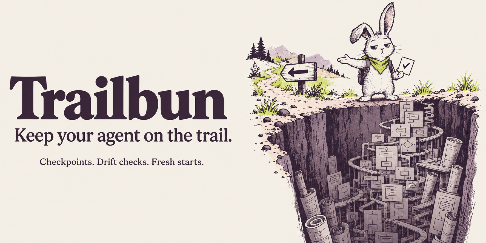
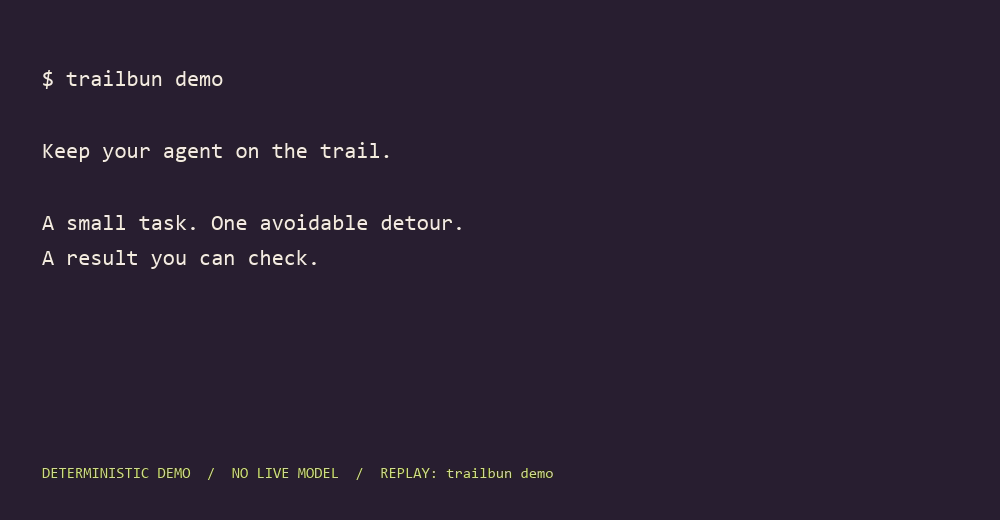

<picture>
  <source media="(prefers-color-scheme: dark)" srcset="assets/hero-dark.png">
  
</picture>

# Trailbun

**Keep your agent on the trail.**

Your agent started with a small bug. Three failed fixes later, it is building a
framework. The original task is somewhere above the stack traces.

Trailbun keeps that task outside the conversation: a fixed baseline, an explicit
scope, compact checkpoints and verification receipts tied to the actual files.
It helps you notice the detour and restart with the facts still intact.

**[Try the demo](#try-it) · [Use it on a project](docs/USAGE.md) · [Inspect the evidence](docs/EVIDENCE.md)**

## Try it

With [uv](https://docs.astral.sh/uv/getting-started/installation/) and Git installed:

```sh
uvx --from git+https://github.com/Daniel-DDV/trailbun@v0.2.0 trailbun demo
```

The demo creates an isolated temporary Git repository, saves a redirect-fix task,
introduces an unnecessary authentication framework, detects the scope violation,
restores a checkpoint and verifies the small fix. It makes no model calls and
does not edit your project.

Save the full result in a new output directory:

```sh
uvx --from git+https://github.com/Daniel-DDV/trailbun@v0.2.0 trailbun demo --output trailbun-demo
```

The output is `trailbun-demo/demo.json`. This is a **deterministic demonstration**,
not a measured before/after claim about an AI agent. From this checkout before the
release tag is published, use `uv run trailbun demo`.



## What it does

| When this happens | Trailbun's response |
| --- | --- |
| The session forgets the task | Restore the goal, exclusions, progress, failed hypotheses and next action from a compact checkpoint. |
| The agent wanders into other files | Compare the current artifact with the original Git baseline, including committed, staged, unstaged and untracked changes. |
| A green check belongs to older code | Mark verification stale when the contract, check definitions or relevant file contents change. |
| The same correction keeps failing | Require a recorded diagnosis after two distinct failed corrective artifacts for the same check. |
| The agent tries to finish without evidence | Request one bounded continuation on supported hosts; keep the task incomplete when checks are missing or stale. |

An explicitly declared initial TDD failure does not count as a failed corrective
attempt. Legitimate scope changes use `amend`, with a reason and the original
baseline retained.

```text
task → checkpoint → check the artifact → diagnose or verify → fresh start
```

## Install

Install the pinned release into uv's isolated tool environment:

```sh
uv tool install git+https://github.com/Daniel-DDV/trailbun@v0.2.0
trailbun --version
```

Requires Python 3.11–3.14 and Git. Installing the CLI does not rewrite your global
agent configuration. Native hooks are a separate, explicit project-local setup
step. See [uv's tool installation documentation](https://docs.astral.sh/uv/guides/tools/).

For a repository you want to use with Claude Code or Codex:

```sh
trailbun setup --host claude --project .
# Or: trailbun setup --host codex --project .
```

Review the generated configuration, then follow [task and session setup](docs/USAGE.md).
Starting a task requires a clean Git worktree. Each native session must explicitly
bind to the task with its host and session ID; an old task on disk does not
silently activate a guard in a new chat.

```sh
trailbun doctor --host claude --project .
trailbun uninstall --host claude --project .
```

Use `--host codex` for Codex. Remove project integration before removing the CLI
with `uv tool uninstall trailbun`. Uninstall leaves task evidence available.

## Commands

| Command | Purpose |
| --- | --- |
| `start` / `amend` | Define the task or record an explicit contract change. |
| `checkpoint` / `resume` | Save a compact handoff or restore task context. |
| `check` / `verify` | Inspect artifact drift or execute acceptance checks. |
| `diagnose` | Record reproduction, cause, evidence and the next experiment. |
| `setup` / `doctor` / `uninstall` | Manage and inspect one project's native integration. |
| `demo` | Replay the isolated demonstration. |

Run `trailbun <command> --help` for arguments. Machine-readable output uses
`--json`; CLI exits are `0` for OK, `1` for a violation and `2` for incomplete work
or an error. Native hook output is translated separately into the host's format.

## Coverage and evidence

A fixture proves the behavior it exercises; a live host receipt proves only its
named version, OS and action path.

| Surface | Current evidence boundary |
| --- | --- |
| Python core | Deterministic regression fixtures; current run results are in [evidence](docs/EVIDENCE.md). |
| Claude Code | Native adapter for declared edit paths; live host receipts pending publication. |
| Codex | Native adapter for declared patch paths; live host receipts pending publication. |
| Shell, MCP and other write paths | No universal pre-write coverage; workspace checks can observe relevant changes after they happen. |
| Grok Build | Deferred; Claude compatibility does not establish working reinjection or blocking. |
| Agent effectiveness | The paired study is pending; no speed, cost or drift-reduction percentage is claimed. |

The [evidence register](docs/EVIDENCE.md) separates pending claims, deterministic
checks, live native behavior and agent study results. The [research notes](docs/RESEARCH.md)
explain why these are different questions.

## Limits worth knowing

- Matching file scope does not prove a change satisfies the user's intent.
- Trailbun is not a sandbox. The agent may have tools outside the paths a hook
  can inspect, and can modify local tooling it is permitted to edit.
- Checkpoints preserve selected state; they do not repair model attention or
  guarantee that supplied context will be used correctly.
- Ignored files are outside the default scan unless explicitly watched. External
  side effects need appropriate acceptance checks and permissions.
- Verification executes commands from the reviewed contract. Use commands
  appropriate for the repository and environment you trust.
- An unavailable hook is not successful enforcement. Inspect `doctor`, the host
  configuration and actual invocation receipts before relying on an adapter.

## Contribute a useful failure

The best contribution is a small reproduction: the intended task, what actually
happened, the host/version and the next check that would have caught it.
See [CONTRIBUTING.md](CONTRIBUTING.md), the [Receipt Card](templates/RECEIPT.md)
and the [15-minute Reality Check](playbook/REALITY_CHECK.md).

The [Nine Laws](field-manual/LAWS.md) explain the engineering discipline. The
[brand notes](docs/BRAND.md) include artwork provenance and reusable assets.

Created by [Daniel Verloop](https://github.com/Daniel-DDV). [MIT license](LICENSE).
